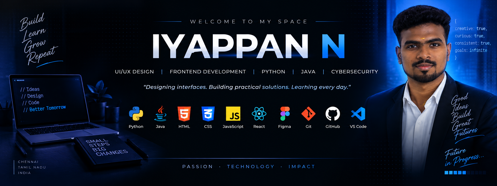
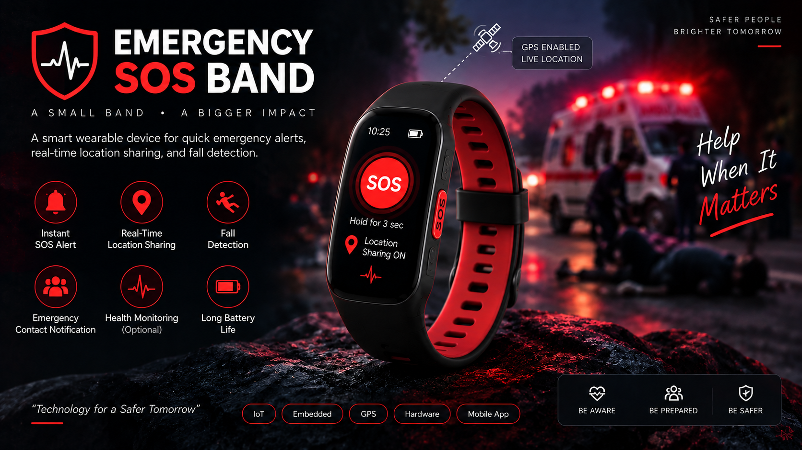
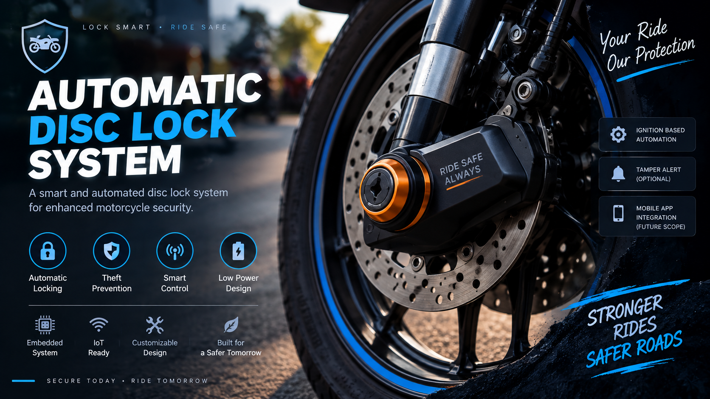
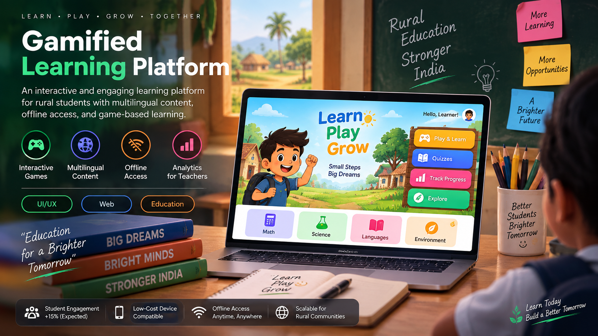
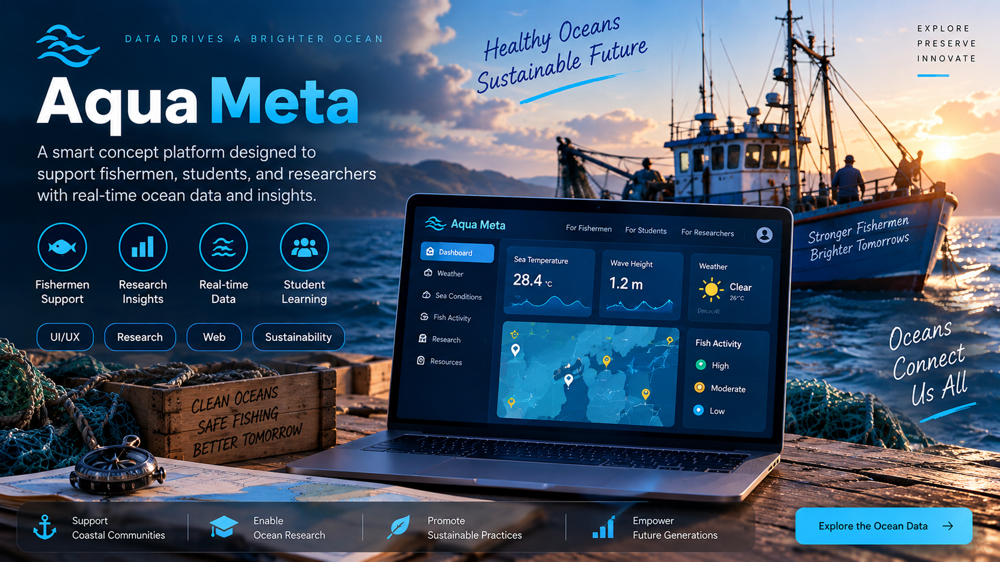

  

# Hi, I'm IYAPPAN N 👋

### Computer Engineering Student | UI/UX Designer | Frontend Developer

I'm a Computer Engineering student interested in building user-friendly, secure, and practical technology solutions. I enjoy working across UI/UX design, frontend development, Python, and cybersecurity.

- 🎓 B.E. Computer Engineering | 2023–2027
- 🎨 UI/UX Design & Frontend Development
- 🐍 Python
- 🔐 Cybersecurity
- 💡 Problem Solving
- 🚀 Open to internships and entry-level opportunities

---

## 🛠️ Technical Skills

### 💻 Programming & Web

**Python · HTML · CSS · JavaScript**

### 🎨 UI/UX & Design

**Figma · Canva · UI/UX Prototyping**

### 🔧 Tools & Technologies

**Git · GitHub · MySQL · VS Code · MS Office**

---

## 🚀 Featured Projects

### 🆘 Emergency SOS Band

Emergency wearable prototype designed for quick emergency alerts, real-time location sharing, and fall detection.

**Focus Areas**
- Instant SOS alerts
- GPS location sharing
- Fall detection
- Emergency contact notification
- IoT & embedded systems

---

### 🔒 Automatic Disc Lock System

Smart motorcycle security prototype designed around automated disc locking and ignition-based control.

**Focus Areas**
- Automatic locking
- Ignition-based automation
- Anti-theft protection
- Embedded control logic
- IoT integration

---

### 🎮 Gamified Learning Platform

UI/UX prototype focused on improving student engagement in rural education.

**Focus Areas**
- Multilingual learning
- Offline accessibility
- Interactive games
- Teacher dashboard
- Student progress tracking

---

### 🌊 Aqua Meta

Concept-based UI/UX platform designed to support fishermen, students, and researchers.

**Focus Areas**
- Fishermen support
- Research insights
- Real-time data
- Student learning
- User-friendly interface

---

## 🏆 Achievements

- 🥇 1st Place – The King's Design Event, XPLORE'24
- 🎨 Participated in PIXEL-UX, IOTRIX'25
- 🏅 NCC Ex-Cadet – 'A' Certificate
- 🤝 NSS Volunteer
- 💡 IIC Member

---

## 📜 Certifications

- Oracle AI Foundations – Oracle
- Internet of Things (Elite) – NPTEL
- Virtual Internship – Help Desk

---

## 💼 Experience

### Help Desk Intern

Technical support, troubleshooting, and IT issue resolution.

### R&D Team Member – Product Development

Contributed to product prototypes including the Emergency SOS Band and Automatic Disc Lock System.

---

## 📚 Currently Learning

- Frontend Development
- UI/UX Design
- Python
- Cybersecurity
- Problem Solving

---

## 📫 Connect With Me

📧 **Email:** [iyappan3170@gmail.com](mailto:iyappan3170@gmail.com)

💼 **LinkedIn:** [linkedin.com/in/iyappan-n](https://www.linkedin.com/in/iyappan-n)

🌐 **Portfolio:** [iyappan-portfolio.vercel.app](https://iyappan-portfolio.vercel.app/)

💻 **GitHub:** [github.com/iyappan-n](https://github.com/iyappan-n)

---

⭐ Thanks for visiting my profile!

**Build · Learn · Grow · Repeat 🚀**
